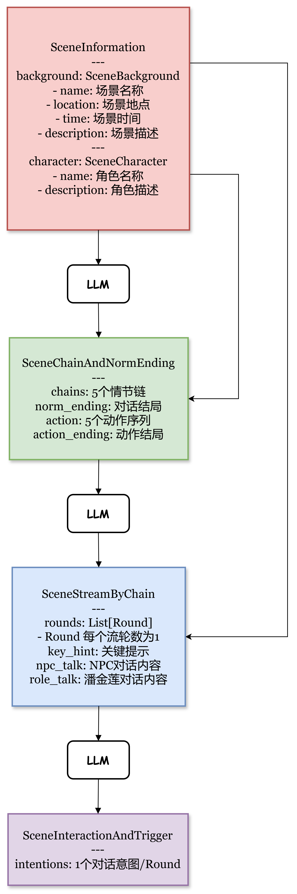

# AI剧情评估框架

AIplot-eval是一个基于AI-Native Interactive AVG （AI原生互动文字游戏）的剧情质量测评框架。其中，编剧智能体用于实时动态生成剧情（单幕/全幕），导演智能体通过剧本组织互动式游戏。

## 任务
给定全幕静态剧本（`script/script_PanJinLian_v2.yml`）和玩家历史游戏数据，动态生成高质量的单幕剧本（剧本格式需要严格按照给定剧本格式），要求剧情逻辑完整、情节连贯、内容创新。

## 目录
```python
|-- code # 该目录下代码可修改
    |-- config.py # 配置文件
    |-- llm.py # LLM Provider
    |-- scriptwriter.py # 编剧智能体（在此处实现AI剧情生成逻辑）
|-- lib # 该目录下代码不可修改
    |-- drama.py # 导演智能体
|-- output # 离线测评输出目录
|-- script
    |-- script_PanJinLian_v2.yml # 验证集剧本
|-- test
    |-- test_offline.py # 离线测评
    |-- test_online.py # 在线测评
README.md
requirements.txt
view.py # 交互式demo
```

## 使用
1. 安装和配置依赖，请参考`requirements.txt`
2. 在`code/config.py`中配置LLM Provider的`URL`和`Key`，样例只提供openailike LLM Provider实现, 其他LLM Provider请自行在`code/llm.py`中实现
3. 在`code/scriptwriter.py`中实现AI剧情生成逻辑
4. 运行`streamlit run view.py`即可启动交互式demo
5. 运行`python test/test_offline.py`即可离线测评（脚本模拟人进行交互得到游戏日志），输出结果在`output/`中

## 实现机制
我们通过plan and write的方式依次生成所需内容，以提高剧本的逻辑性，并通过预置设定增加生成的多样性。
1. 首先，生成SceneInformation，描述场景信息和人物信息
2. 其次，基于SceneInformation生成SceneChainAndNormEnding，其中包含情节链和一系列动作，以及两类结局：对话导致的结局和动作导致的结局 (如注意事项所述，对话结局实际上不被触发)
3. 基于前述内容，生成流。定义了SceneStreamByChain类和Round类，前者包含了n个rounds，从而允许动态数量的生成，此处轮数为1，即每个流中潘金莲和NPC来回对话一次。Round的生成需要依赖历史轮内容，以确保上下文一致性
4. 最后，基于历史轮生成每个轮的对话，即SceneInteractionAndTrigger类，包含允许动态数量的intentions，此处为1，即每轮中生成一个对话意图，并行生成
5. 将上述内容组合为输出



## 注意事项
尽管我们严格遵循任务要求，准确提供了生成结果，并且着重关注剧本的优化，有以下事项影响了剧本本身，是需要注意的：
### 1. "对话"实际上不能发生作用 (在yaml文件剧本中，部分起作用，但在示例格式中完全无效)
    通过对"交互"中"对话"的测试，我们发现：
        a. "对话"不能被作为()中判定的条件 (对"动作"，"对话"都一样，情节链后的()实际上不被读取)
        b. 不能触发跳转
        c. 选择过的"对话"也不会消失，持续进入候选意图用于生成预设对话
这意味着，"对话"永远不会导致结局，且"对话"的顺序很难前后逻辑通顺 (因为预设对话会持续基于同一对话意图池随机生成，选择也是随机的)

### 2. "关键提示"实际上仅发生作用一次 (在示例格式和yaml文件剧本中都一样)
    "关键提示"只在第一个流加载时被载入，后续通过触发获得的"关键提示"和流中的"关键提示"不会用于指导预设对话生成
这意味着，通过"关键提示"引导预设对话生成时"对话"的选择也是做不到的

### 3. 综上所述，结局总会是动作导致的，且对话逻辑顺序无法被约束
